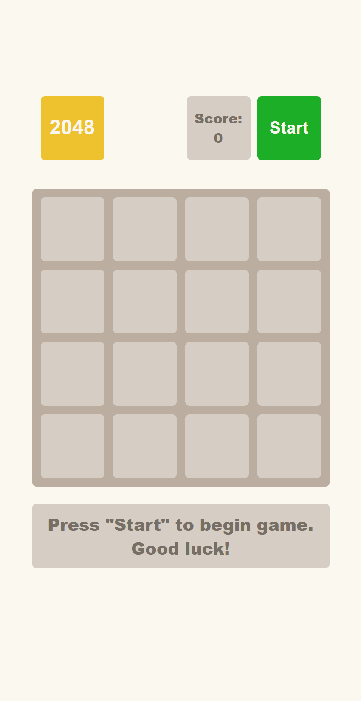

# 🎮 2048 Game

A web-based implementation of the popular sliding tile puzzle game "2048". This project demonstrates complex JavaScript logic, array manipulation, and DOM interaction to recreate the classic addictive gameplay experience.

## Live Demo

Experience the live website: [2048 Game Demo](https://vnechepurenko2005.github.io/2048_game/)

## Screenshots



## Technologies Used💻

### Core
* **HTML5** – Semantic structure for the game grid
* **SCSS** (Sass) – Styling
* **JavaScript** (ES6+) – Core game engine and logic

### Game Logic & UI
* **Matrix Logic** – Algorithms for grid manipulation and tile merging
* **Event Listeners** – Handling keyboard inputs (Arrow keys)
* **DOM Manipulation** – Dynamic rendering of tiles and score updates

### Development & Deployment
* **Git** – Version control system
* **GitHub Pages** – Hosting
* **VS Code** – Development environment

## Get Started

1. Clone the repository:
```bash
git clone https://github.com/vnechepurenko2005/2048_game.git
cd 2048_game
```
2. Install dependencies:
```bash
npm install
# or
yarn install
```
3. Run the project locally:
```bash
npm start
# or
yarn start
```

## Features ✨

* **Classic Gameplay**: Authentic 2048 rules where tiles merge (2+2=4, 4+4=8) to reach the 2048 tile.
* **Score Tracking**: Real-time score calculation based on merged tiles.
* **Game States**: Detection of "Game Over" (no moves left) and "You Win" scenarios.
* **Keyboard Control**: Full support for arrow keys on desktop.
* **Restart Functionality**: Ability to reset the game board and start over instantly.

## Author ✒️

* **Vladyslav Nechepurenko** – [GitHub Profile](https://github.com/vnechepurenko2005)
